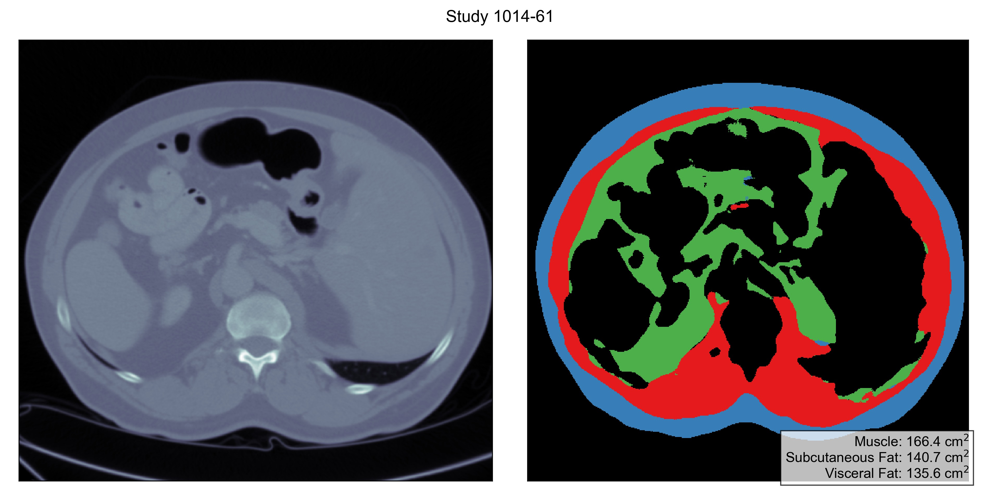

# Body Composition Assessment Dataset

This repository contains the data and code for the works
- "Artificial Intelligence to Assess Body Composition on Routine Abdominal CT Scans and Predict Mortality in Pancreatic Cancer – A Recipe for Your Local Application", *European Journal of Radiology* (2021)
- "Fully Automated AI Body Composition Quantification from Abdominal CT Scans - Training Data, Model Code and Trained Weights", *Data in Brief* (2021)

Overall, we annotate 40 studies from the publicly available [LiTS Dataset](https://competitions.codalab.org/competitions/17094) on slices at the level of L3 vertebrae, and learn models to automatically assess body composition.


Due to the large file sizes, the models and the data are not tracked by `git` and will have to be downloaded with the following instructions.

## Prerequisites

1. Linux (Ubuntu 16.04 tested)
2. Python 3.7+
3. Nvidia GPU (cuDNN 8.0 and CUDA 11.0)

## Getting Started
We will walk you through some simple steps to run inference with our trained weights and an example LiTS study.

1. Clone this repository.
    ```bash
    git clone https://github.com/stmharry/body-composition.git && cd body-composition
    ```

2. Download models and an example CT.
    ```bash
    # Copy and paste this command to your command line
    curl https://body-composition.s3.amazonaws.com/models.tar.gz | tar -zx -C .
    # or if you feel lazy, use the pre-packed command
    make pull-model
    ```

3. Install required packages. (or use virtual environment)
    ```bash
    # Setting up virtual environment (optional)
    virtualenv -p python3.7 venv && source venv/bin/activate
    # or if you are using conda
    conda create -n venv python=3.7 && conda activate venv && conda install pip
    # pip install
    pip install -r requirements.txt
    ```

4. Run the model prediction on the example CT and collect outputs at `./results`.
    ```bash
    make STAGE=first && make STAGE=second
    ```

By this point, you should expect a new directory `results` with this file hierarchy:
```bash
results
├── first
│   ├── 1014-2.nii.gz
│   ├── ... 
│   ├── 1014.pdf
│   ├── 1014.png
│   ├── all.pdf
│   └── stat.csv
└── second
    ├── 1014-2.nii.gz
    ├── 1014-2.pdf
    ├── 1014-2.png
    ├── ... 
    ├── all.pdf
    └── stat.csv
```

The folder `results/first` contains inference results for the first stage of the model which detects the L3 vertebra, and `results/second` performs second-stage analysis on each of the proposed slice.
Example outputs are shown as follows:




## The Data

The Liver Tumor Segmentation Challenge released [200 CT scans](https://competitions.codalab.org/competitions/17094) in total, from which we select 29 training studies and 12 test studies for annotation.
To fetch the data, run
```bash
# Copy and paste this command to your command line
curl https://body-composition.s3.amazonaws.com/data.tar.gz | tar -zx -C .
# or if you feel lazy, use the pre-packed command
make pull-data
```

In `data/studies`, you can find raw studies (in NIFTI `.nii.gz` format) that we have annotated, and in `data/masks`, the per-pixel annotation (also in NIFTI format).
Each study has a slice labeled with three tissue types:
- Muscle (label `1`),
- Subcutaneoue Fat (label `2`), and
- Visceral Fat (label `3`).


## Using Your Own Data

### Inference 

It is straightforward to use your own CT data for inference. 
Simply create volumes in NIFTI format with the voxels in [RAS+ orientation](https://nipy.org/nibabel/image_orientation.html) and a shape of `[512, 512, slices]` where `slices` can be arbitrary.
Place this study under `data/studies` and rerun `./predict.sh`, and you can extract the corresponding inference results in `results`.

### Training

To prepare data for training, it is one more step than placing the files in `data/studies`: you also have to assign them into either the training set or the evaluation set.
In files `data/splits/first/{train,eval}.txt` you should add the names of your study depending on the data split you wish to put them into. 
These two files are for training/evaluating the first stage, and the same process goes similarly for the second stage where you would modify `data/splits/second/{train,eval}.txt`.

To kick off training with the new training splits, run the following commands to train two stages respectively:

```bash
# Training the first stage
make DO=train_eval STAGE=first
# Training the second stage
make DO=train_eval STAGE=second
```

New models will be saved in `models/<some-fancy-timestamp>`, and you can use `tensorboard` to monitor the training process with `tensorboard --logdir models`.

## Reference

For any question, please contact [Tzu-Ming Harry Hsu](mailto:stmharry@mit.edu).
